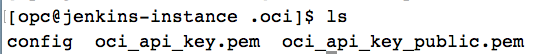
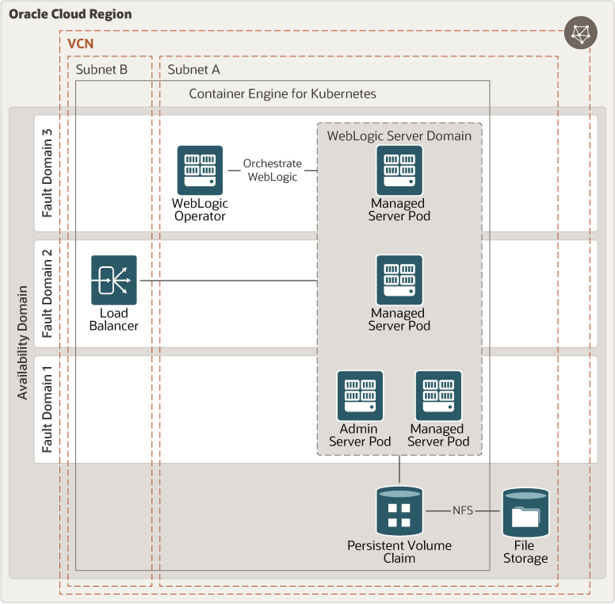

# oci-arch-weblogic-oke

Oracle supports customers who want to run Oracle WebLogic Server clusters in various ways: in production mode, in development mode, on Kubernetes clusters on-premises, and in the cloud. Running WebLogic on Kubernetes offers a balance among automation, portability, and the ability to customize multiple domains. The Oracle WebLogic Server Kubernetes Operator, an open source tool, simplifies the process of creating and managing multiple domains in a Kubernetes cluster.

This reference architecture describes the steps for running a WebLogic cluster using the Oracle Cloud Infrastructure Container Engine for Kubernetes service. The service is fully integrated with the underlying Oracle Cloud Infrastructure, which makes it easy to provision a Kubernetes cluster and provide the required services, such as a load balancer, block volumes, and the network. We simplify the process by using Terraform to automate the infrastructure.

## Terraform Provider for Oracle Cloud Infrastructure
The OCI Terraform Provider is now available for automatic download through the Terraform Provider Registry. 
For more information on how to get started view the [documentation](https://www.terraform.io/docs/providers/oci/index.html) 
and [setup guide](https://www.terraform.io/docs/providers/oci/guides/version-3-upgrade.html).

* [Documentation](https://www.terraform.io/docs/providers/oci/index.html)
* [OCI forums](https://cloudcustomerconnect.oracle.com/resources/9c8fa8f96f/summary)
* [Github issues](https://github.com/terraform-providers/terraform-provider-oci/issues)
* [Troubleshooting](https://www.terraform.io/docs/providers/oci/guides/guides/troubleshooting.html)

## Clone the Module
Now, you'll want a local copy of this repo. You can make that with the commands:

    git clone https://github.com/oracle-quickstart/oci-arch-weblogic-oke
    cd oci-arch-weblogic-oke
    ls

## Prerequisites
First off, you'll need to do some pre-deploy setup.  That's all detailed [here](https://github.com/cloud-partners/oci-prerequisites).

Secondly, create a `terraform.tfvars` file and populate with the following information:

```
# Authentication
tenancy_ocid         = "<tenancy_ocid>"
user_ocid            = "<user_ocid>"
fingerprint          = "<finger_print>"
private_key_path     = "<pem_private_key_path>"

# SSH Keys
ssh_public_key  = "<public_ssh_key_path>"

# Region
region = "<oci_region>"

# Compartment
compartment_ocid = "<compartment_ocid>"

````

Deploy:

    terraform init
    terraform plan
    terraform apply


## Post-Deployment Setup

### Step 1: Configure OCI-CLI

On your local machine terminal, make sure oci-cli is installed using: 

`oci -v`

If not, follow the below link to install and setup OCI-CLI.

`https://docs.cloud.oracle.com/en-us/iaas/Content/API/SDKDocs/cliinstall.htm`

Next, run the command `oci setup config`

Press `Enter` when prompted for a location for config file.

Press `Enter` when prompted for directory name to accept the default.

Enter the details about user OCID, tenancy OCID and region.

Enter `Y` for `New RSA key pair`. 

Press Enter and accept default options for directories for keys and name for the keys. 

Press Enter when prompted for passphrase so as to leave it blank.

Verify all the files exists by checking in -> `cd /home/opc/.oci` and then `ls`.

You should see these files.



Run `cat config` and make sure all the details about tenancy are correct.

Now, do `cat oci_api_key_public.pem` and copy the contents of the file. 

Login to OCI console, go to your profile and then your username. 

Click on `Add Public Key` and paste the contents of the file copied in last step. 

Make sure the `fingerprint` is generated and also check it is same as the one in Jenkins Instance `/home/opc/.oci/config` file. 

We are done.

### Step 2: Generate OCIR token

Login to OCI console.

Click on your `Profile` -> `User Settings`. On the bottom left, click on `Auth Tokens`. Click on `Generate Token`.

Provide a discription and then hit `Generate Token`. This will generate a token. Make sure to copy the token and save it for future steps.

### Step 3: Install kubectl and configure kube-config

Install kubectl using below command:

````
curl -LO https://storage.googleapis.com/kubernetes-release/release/`curl -s https://storage.googleapis.com/kubernetes-release/release/stable.txt`/bin/linux/amd64/kubectl;chmod +x ./kubectl;sudo mv ./kubectl /usr/local/bin/kubectl;kubectl version --client
````

Now, to setup kubeconfig, go to your OCI tenancy. On the left hand side click on `Developer Services`. Select `Container Clusters (OKE)`. 
 
Click on the cluster created by terraform earlier.

On the top, click on `Access Kubeconfig` and run the commands specified.

Once done, verify you can access the OKE nodes, by typing:

`kubectl get nodes`

You will see the details of the nodes running on the cluster.

### Step 4: Install Docker and Git

Inatall docker and git using below commands.

````
sudo yum update -y
sudo yum install -y java git docker-engine
sudo systemctl start docker
sudo systemctl enable docker
````

### Step 5: Weblogic deployment

Follow the below link to the deploy weblogic domain on OKE cluster. Note that OKE cluster

`https://github.com/nagypeter/weblogic-on-oke-workshop/blob/master/tutorials/setup.weblogic.kubernetes.v1.md`

## Destroy the Deployment
When you no longer need the deployment, you can run this command to destroy it:

    terraform destroy

## WebLogic Server on Kubernetes Architecture




## Reference Archirecture

- [Deploy Oracle WebLogic Server in a Kubernetes cluster](https://docs.oracle.com/en/solutions/deploy-wls-on-oke/index.html)
